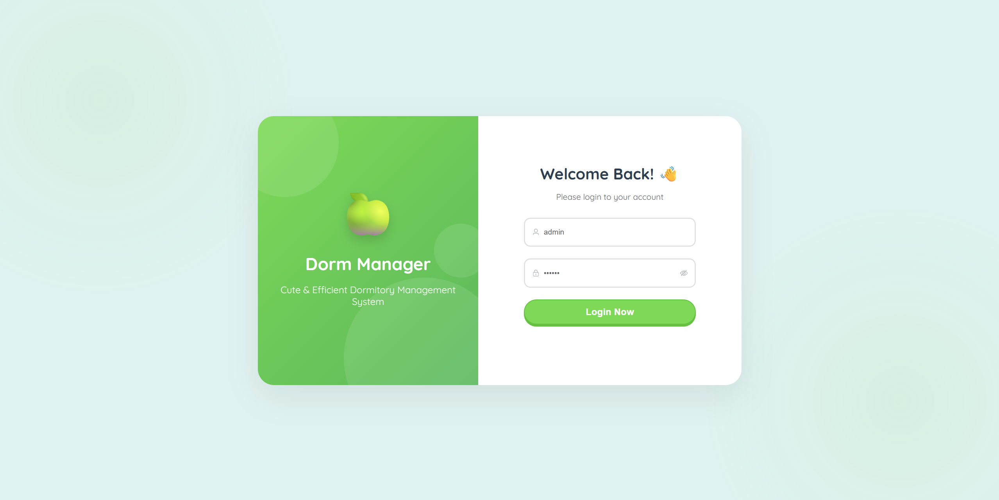
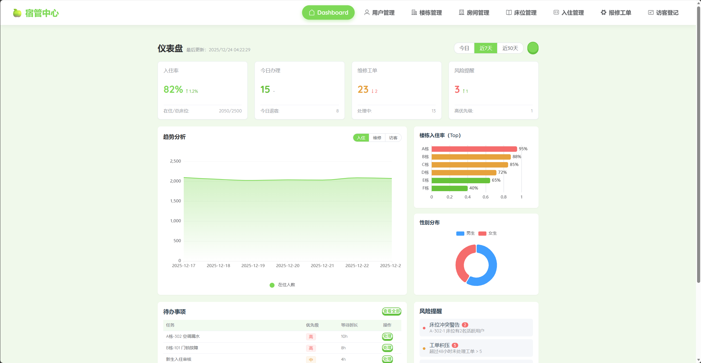
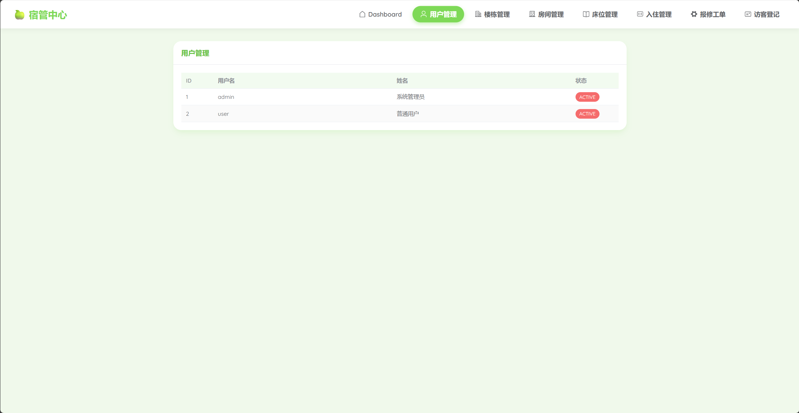
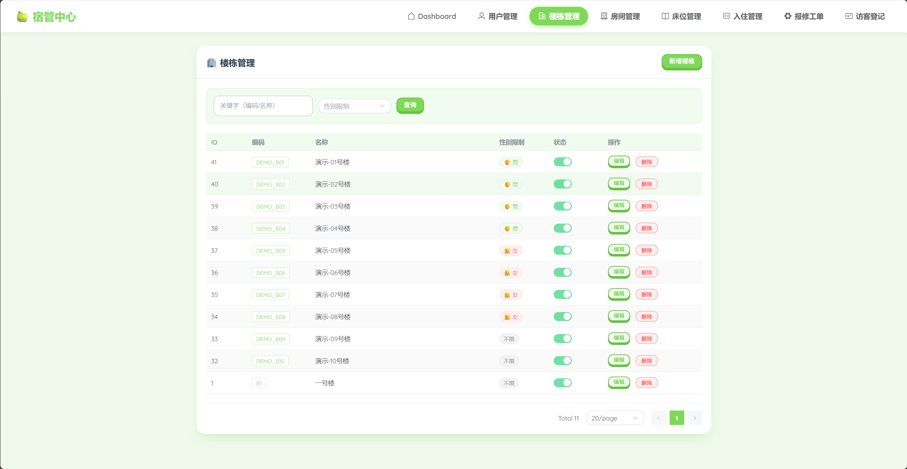
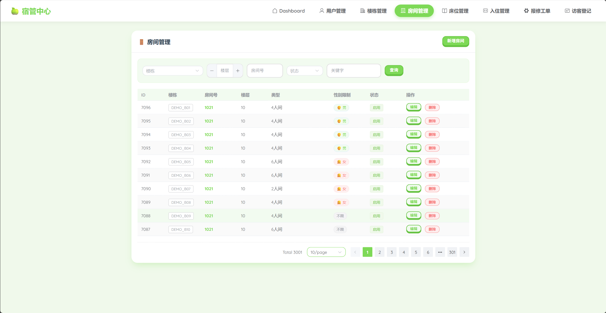
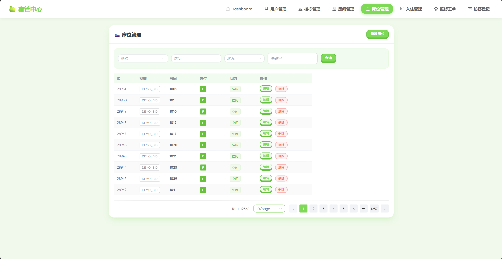
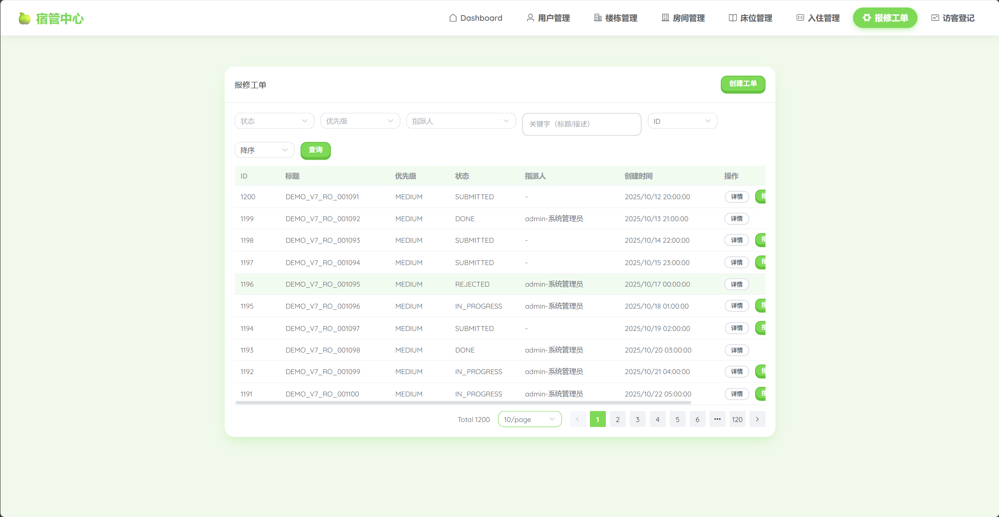
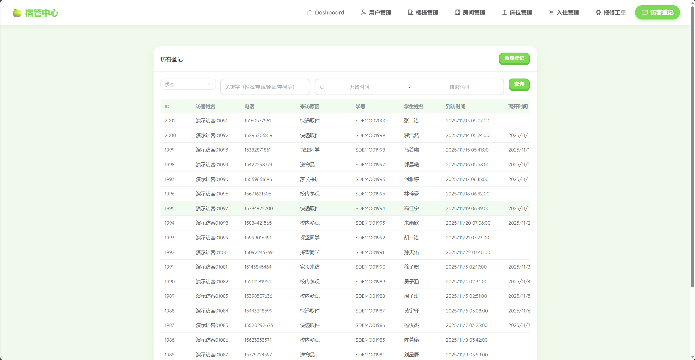

# 宿舍管理系统（Dormitory Management System）

一个基于 **Spring Boot 3 + MySQL + Vue 3 + Element Plus** 的宿舍管理后台系统，包含仪表盘、宿舍楼/房间/床位管理、学生入住管理、报修工单、访客登记与权限控制。

## 功能特性

- **登录 / 注册**（JWT）
- **仪表盘**：关键指标、趋势分析、分布统计、待办与风险提醒
- **宿舍资源**：楼栋 / 房间 / 床位管理
- **学生管理**
- **入住管理**：入住/调宿/退宿记录
- **报修工单**：工单列表、状态流转（示例数据）
- **访客登记**
- **RBAC 权限**：基于角色-权限的接口与前端路由控制

## 技术栈

- **后端**：Java 17、Spring Boot 3、Spring Security、Flyway、MySQL 8
- **前端**：Vue 3、Vite、TypeScript、Pinia、Vue Router、Element Plus、ECharts

## 快速开始

### 1) 后端（dormitory-server）

#### 环境要求

- Java 17+
- Maven 3.8+
- MySQL 8+

#### 数据库

- 创建数据库：`dormitory`
- 配置文件：`dormitory-server/src/main/resources/application.yml`

默认配置：

- DB：`jdbc:mysql://127.0.0.1:3306/dormitory`
- 用户名：`root`
- 密码：`123456`

JWT 配置（可通过环境变量覆盖）：

- `APP_JWT_SECRET`（至少 32 字节）
- `APP_JWT_EXP_SECONDS`（默认 7200 秒）

#### 启动

在 `dormitory-server` 目录执行：

- `mvn spring-boot:run`

启动后默认端口：`http://localhost:8080`

### 2) 前端（dormitory-admin-web）

#### 环境要求

- Node.js 18+

#### 安装与启动

在 `dormitory-admin-web` 目录执行：

- `npm install`
- `npm run dev`

前端通过 Vite 代理把 `/api` 转发到 `http://localhost:8080`（见 `dormitory-admin-web/vite.config.ts`）。

## 默认账号

数据库种子（Flyway）默认创建：

- **admin / 123456**（超级管理员）

你也可以在登录页点击 **“去注册”** 自助注册新账号。

## 接口说明（认证）

- `POST /api/v1/auth/login`
- `POST /api/v1/auth/register`
- `GET /api/v1/auth/me`

## 项目结构

- `dormitory-server/`：后端服务
- `dormitory-admin-web/`：前端管理后台
- `img/`：项目截图（README 引用）

## 项目截图

> 如果你执行了截图重命名（见下方“截图重命名”），这里会按新命名展示。

- 登录页

  

- 仪表盘

  

- 用户管理

  

- 楼栋管理

  

- 房间管理

  

- 床位管理

  

- 入住管理

  

- 报修工单

  

- 访客登记

  

## License

MIT
