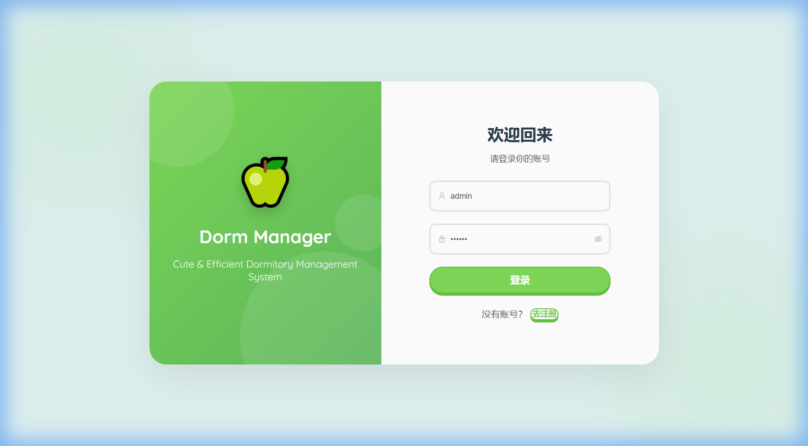
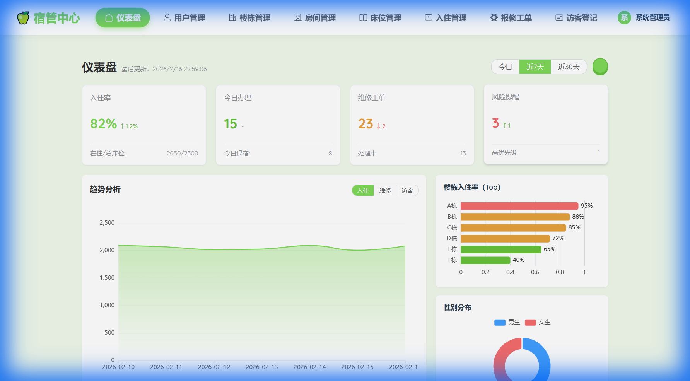
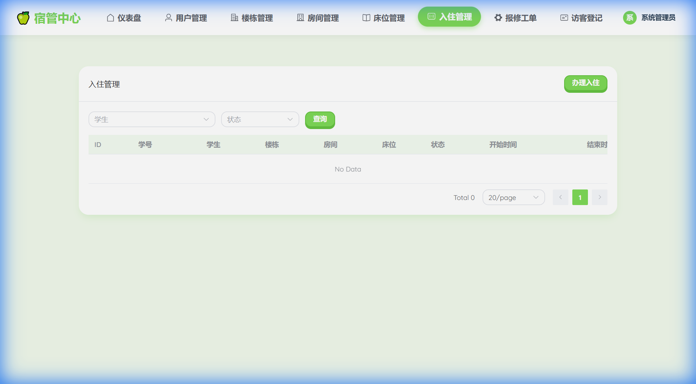
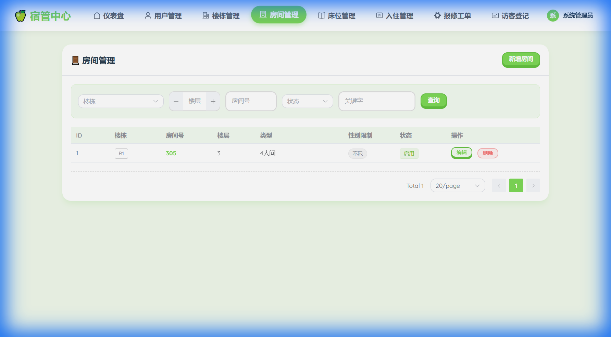
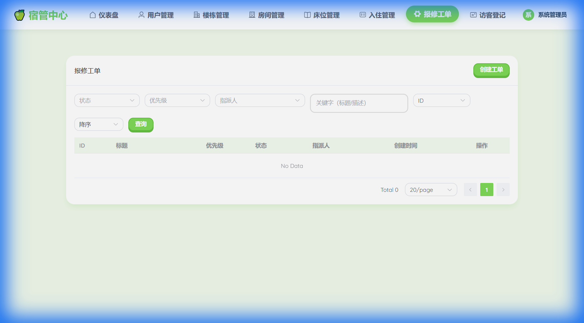
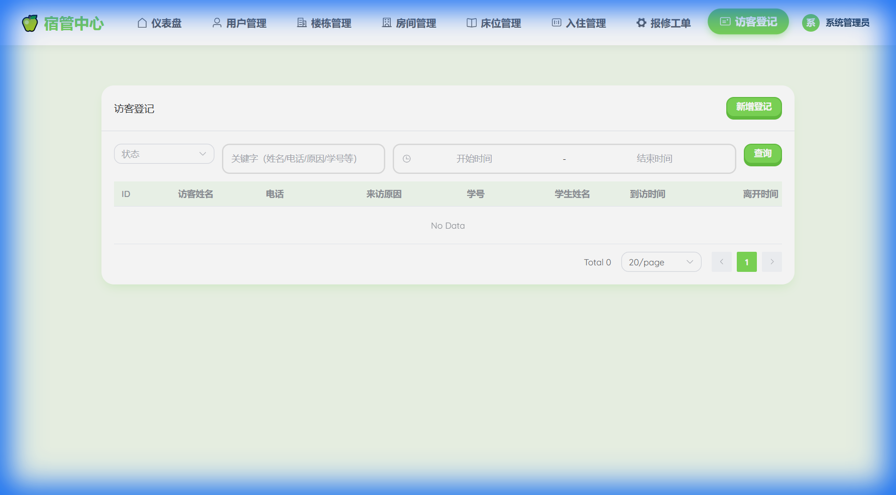

# 宿舍管理系统（Dormitory Management System）

一个基于 **Spring Boot 3 + MySQL + Vue 3 + Element Plus** 的宿舍管理后台系统，包含仪表盘、宿舍楼/房间/床位管理、学生入住管理、报修工单、访客登记与权限控制。

---

## 功能特性

- **登录 / 注册**（JWT）
- **仪表盘**：关键指标、趋势分析、分布统计、待办与风险提醒
- **宿舍资源**：楼栋 / 房间 / 床位管理
- **学生管理**
- **入住管理**：入住/调宿/退宿记录
- **报修工单**：工单列表、状态流转
- **访客登记**
- **RBAC 权限**：基于角色-权限的接口与前端路由控制

---

## 环境要求

| 依赖       | 版本    | 备注 |
|-----------|---------|------|
| JDK       | 17+     | 必须 |
| Maven     | 3.8+    | 必须 |
| Node.js   | 18+ LTS | 推荐 18 或 20 LTS |
| MySQL     | 8.0+    | 仅 MySQL 模式需要；H2 模式无需安装 |

---

## 标准化快速启动 — H2 内存数据库 (Zero Install)

无需安装 MySQL，一键启动用于快速验证。

### 1) 启动后端 (H2)
```bash
cd dormitory-server
mvn spring-boot:run -Dspring-boot.run.profiles=dev-h2
```
- 后端: `http://localhost:18082`
- H2 Console: `http://localhost:18082/h2-console`

### 2) 启动前端
```bash
cd dormitory-admin-web
npm install   # 仅首次
npm run dev -- --port 15174 --host
```
- 前端: `http://localhost:15174`

---

## 快速开始 — MySQL 模式 (生产)

### 1) 准备数据库

默认配置位于 `dormitory-server/src/main/resources/application.yml`：

| 项目     | 默认值 |
|----------|--------|
| Host     | `127.0.0.1:3306` |
| Database | `dormitory` |
| Username | `root` |
| Password | `123456` |

```sql
CREATE DATABASE dormitory DEFAULT CHARACTER SET utf8mb4 COLLATE utf8mb4_unicode_ci;
```

### 2) 启动后端
```bash
cd dormitory-server
mvn spring-boot:run
```
- 后端: `http://localhost:8080`
- Flyway 自动建表 + 初始化数据。

### 3) 启动前端
```bash
cd dormitory-admin-web
npm install   # 仅首次
npm run dev -- --port 15174 --host
```

---

## 端口一览

| 服务   | H2 (dev-h2) | MySQL (default) |
|--------|-------------|-----------------|
| 后端   | 18082       | 8080            |
| 前端   | 15174       | 15174           |

---

## 数据库模式

| Profile    | 数据库    | 配置文件 |
|------------|----------|---------|
| *(default)* | MySQL 8  | `application.yml` |
| `dev-h2`   | H2 (内存, MODE=MySQL) | `application-dev-h2.yml` |

H2 模式使用 `MODE=MySQL` 保证 SQL 兼容性。每次重启数据会重置。

---

## 默认账号

数据库种子（Flyway）默认创建：

| 用户名 | 密码   | 角色 |
|--------|--------|------|
| admin  | 123456 | 超级管理员 |

也可在登录页点击 **"去注册"** 自助注册新账号。

---

## 接口说明（认证）

| 接口 | 方法 | 说明 |
|------|------|------|
| `/api/v1/auth/login` | POST | 登录 |
| `/api/v1/auth/register` | POST | 注册 |
| `/api/v1/auth/me` | GET | 当前用户 |

---

## 项目结构

```
Dormitory-management-system/
├── dormitory-server/       # 后端服务 (Spring Boot + MyBatis + Flyway)
├── dormitory-admin-web/    # 前端管理后台 (Vue 3 + Element Plus + ECharts)
├── img/                    # 项目截图
└── README.md
```

---

## 项目截图

| 页面 | 截图 |
|------|------|
| 登录页 |  |
| 仪表盘 |  |
| 入住管理 |  |
| 房间管理 |  |
| 报修工单 |  |
| 访客登记 |  |

---

## FAQ

**Q: H2 模式启动后数据是否持久化？**
A: 不会。H2 使用内存模式 (`mem:dormitory`)，每次重启数据会重置。Flyway 会自动重新建表和加载种子数据。

**Q: 忘记密码怎么办？**
A: H2 模式重启后恢复默认 admin/123456。MySQL 模式可直接修改数据库 `sys_user` 表的密码字段。

**Q: 前端代理如何配置？**
A: `dormitory-admin-web/vite.config.ts` 中 `/api` 代理到后端地址，H2 模式下需确认端口匹配 (18082)。

---

## License

MIT
